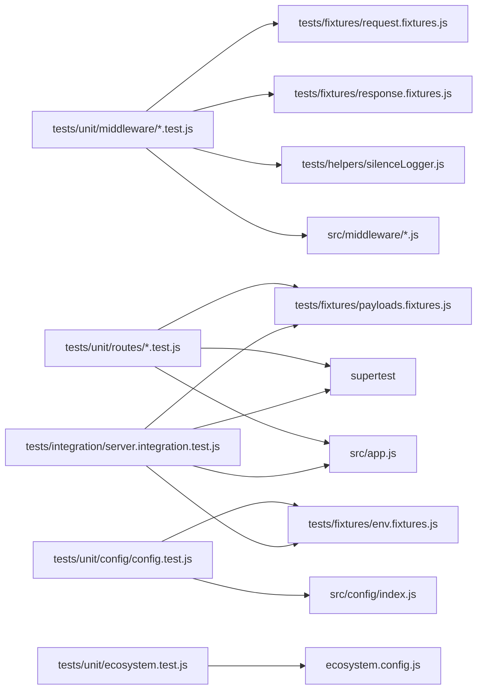

# Technical Specification

# 0. Agent Action Plan

## 0.1 Intent Clarification

### 0.1.1 Core Testing Objective

Based on the provided requirements, the Blitzy platform understands that the testing objective is to **establish a comprehensive unit and integration test suite for an Express.js-based modernization of the existing zero-dependency Node.js HTTP server**, which presently consists of a single 14-line `server.js` file using only the built-in `http` module to return `Hello, World!\n` on `127.0.0.1:3000`.

The user's prompt — *"Enhance this basic HTTP server with Express.js framework, add routing, middleware, environment config, logging, and prepare for production deployment with PM2"* — implicitly mandates the simultaneous introduction of testing infrastructure for every newly added concern, since the existing repository has no test files, no testing framework, no test configuration, and a deliberately failing placeholder `npm test` script (`echo "Error: no test specified" && exit 1`) carried over from `npm init -y` defaults.

**Request Categorization:** **Add new tests** (greenfield test suite) — the repository contains zero test files, no `__tests__/`, `test/`, `spec/`, or `tests/` directories, and no testing tooling listed in `package.json` or `package-lock.json`. Every test artifact described in this Agent Action Plan represents a `CREATE` operation; no `UPDATE`, `DELETE`, or `REFERENCE` test transformations apply because there is no pre-existing test corpus to update, remove, or reference.

**Enhanced Testing Requirements (one-to-one mapping with user prompt elements):**

| User Prompt Element | Testing Requirement (Enhanced) |
|---------------------|--------------------------------|
| "Enhance this basic HTTP server with Express.js framework" | Verify the Express application instance is correctly instantiated, exports cleanly without invoking `listen()`, and responds to HTTP requests via Supertest in-process injection (no real port binding during tests) |
| "add routing" | Verify each Express route handler returns the correct status code, content-type, and response body for every defined path and HTTP method, including 404 fall-through for unknown routes |
| "middleware" | Verify each registered middleware (request logging, body parsing, error handling, security headers) is invoked in the correct order, mutates `req`/`res` as expected, and propagates control via `next()` or terminates with a response |
| "environment config" | Verify configuration values are loaded from `process.env` via `dotenv`, that defaults are applied when variables are absent, that schema validation rejects malformed values, and that the configuration module is idempotent across re-imports |
| "logging" | Verify Winston (or equivalent) logger emits expected log levels, includes correlation metadata, and is silenced or redirected during test runs to prevent noisy test output |
| "prepare for production deployment with PM2" | Verify the `ecosystem.config.js` file parses as a valid CommonJS module exporting an `apps` array with required PM2 fields (`name`, `script`, `instances`, `exec_mode`, `env`, `env_production`), and that the configuration matches the documented runtime contract |

**Implicit Testing Needs Surfaced from the User Prompt:**

- **Edge cases for routing** — empty paths, trailing slashes, case sensitivity, query strings, malformed URLs
- **Middleware error propagation** — synchronous throws, asynchronous rejections, and Express 5's automatic promise-rejection forwarding
- **Configuration boundary conditions** — missing variables, empty strings, non-numeric `PORT` values, unsupported `NODE_ENV` values
- **HTTP method coverage** — `GET`, `POST`, `PUT`, `DELETE`, `PATCH`, `OPTIONS`, `HEAD` against each route to verify the router's method-not-allowed behavior
- **Content negotiation** — JSON vs. text responses, `Accept` header handling, charset assertions
- **Server lifecycle separation** — `app.js` (Express app instance) must be exported separately from `server.js` (which calls `listen()`) so tests can import the app without binding to a port
- **Logger behavior across environments** — silent in `test`, verbose in `development`, structured JSON in `production`
- **PM2 ecosystem-file portability** — file must parse under Node.js v22 CommonJS resolution given `package.json` lacks `"type": "module"`

### 0.1.2 Special Instructions and Constraints

**CRITICAL Directives Captured from the User Prompt and Project Context:**

- **Greenfield test creation only** — because the repository currently has zero tests, all listed transformations are `CREATE` operations; no existing test patterns or conventions exist in the repository to follow
- **Test the post-enhancement Express architecture** — tests target the new Express app, routes, middleware, configuration loader, logger, and PM2 ecosystem file that the broader implementation introduces, not the legacy 14-line `http`-module `server.js`
- **Test isolation via Supertest** — all HTTP-level assertions use Supertest's in-process injection so tests do not bind real TCP ports and do not collide with any developer-run server on port 3000
- **No source code modifications beyond what is required for testability** — the only source-code change driven by the testing strategy itself is the conventional separation of `app.js` (exports the Express `app`) from `server.js` (calls `app.listen()`); this separation is industry-standard practice for Express + Supertest setups and is required to avoid `EADDRINUSE` errors during parallel test runs
- **Maintain test independence** — every test file must be runnable in isolation (`jest path/to/file.test.js`) without relying on shared global state or test-ordering side effects
- **Match Node.js v22 runtime** — the host environment uses Node.js v22.22.2 and npm 11.1.0, so Jest 30.x (which mandates Node 18+) and Supertest 7.x are the version baselines

**Documented Testing Conventions to Adopt (since none pre-exist in the repository):**

- Use Jest's CommonJS `require()` semantics to match the existing `package.json` (no `"type": "module"` declaration, so all files default to CommonJS)
- Co-locate unit tests under `tests/unit/` and integration tests under `tests/integration/`, with fixtures under `tests/fixtures/` and helpers under `tests/helpers/`
- Name test files using the `*.test.js` suffix to match Jest's default `testMatch` pattern
- Use `describe` blocks per module/route group and `it`/`test` blocks per behavior
- Apply the Arrange-Act-Assert pattern within each test
- Mock external dependencies (Winston transports, file system writes) but never mock the code under test

**User Examples Preserved:**

User Example: *"Enhance this basic HTTP server with Express.js framework, add routing, middleware, environment config, logging, and prepare for production deployment with PM2."* — This single-sentence directive is the entirety of the user's testing-relevant input and is preserved verbatim for traceability. No additional examples, snippets, or specific test patterns were provided by the user.

**Web Search Research Conducted (results inform version pinning and pattern selection):**

- Jest 30.x release notes and migration guide (Jest 30 mandates Node 18+, drops Node 14/16/19/21, upgrades `jest-environment-jsdom` to v26)
- Supertest 7.x documentation (latest stable 7.2.2, supports HTTP/2, accepts `http.Server` or Express `app` directly)
- Express.js 5.1.0 testing implications (auto-handles rejected promise middleware, requires Node 18+)
- dotenv-with-Jest patterns (`setupFiles: ["dotenv/config"]` in `jest.config.js` is the canonical loading approach)
- Winston logger mocking strategies (use `jest.mock('winston')` or pass a silent transport in test mode)
- PM2 `ecosystem.config.js` schema and CommonJS-vs-ESM compatibility considerations

### 0.1.3 Technical Interpretation

These testing requirements translate to the following technical test implementation strategy:

- **To verify the Express application bootstraps correctly**, we will create `tests/unit/app.test.js` that imports the `app` module, asserts it is a function with `app.use`, `app.get`, `app.post` methods, and confirms it does not auto-bind to a port on import.

- **To verify routing**, we will create `tests/unit/routes/*.test.js` files (one per route module — for example `tests/unit/routes/index.test.js` for the root route, `tests/unit/routes/health.test.js` for a `/health` endpoint if introduced) that use Supertest to issue requests against the `app` instance and assert status codes, response bodies, and content-types.

- **To verify middleware behavior**, we will create `tests/unit/middleware/*.test.js` files (for example `tests/unit/middleware/requestLogger.test.js`, `tests/unit/middleware/errorHandler.test.js`, `tests/unit/middleware/notFoundHandler.test.js`) that invoke each middleware function with mocked `req`, `res`, `next` objects (using `@jest-mock/express` or hand-rolled mocks) and assert side effects on those objects.

- **To verify environment configuration**, we will create `tests/unit/config/config.test.js` that uses `jest.resetModules()` between tests, manipulates `process.env` directly within `beforeEach`, re-`require`s the config module, and asserts the resulting configuration object reflects the expected defaults and overrides.

- **To verify logging**, we will create `tests/unit/logger/logger.test.js` that imports the logger module under a test environment (`NODE_ENV=test`), spies on Winston's `log` method via `jest.spyOn`, invokes log calls at each level (`error`, `warn`, `info`, `debug`), and asserts the spy was called with correct arguments and metadata.

- **To verify the PM2 ecosystem configuration**, we will create `tests/unit/ecosystem.test.js` that `require`s `ecosystem.config.js`, asserts the structural shape of the exported object (`apps` is an array, each app entry has the required keys), and validates value types and ranges (`instances` is a number or `'max'`, `exec_mode` is `'fork'` or `'cluster'`, `env_production.NODE_ENV === 'production'`).

- **To verify end-to-end Express request handling**, we will create `tests/integration/server.integration.test.js` that imports the `app`, fires a sequence of Supertest requests covering happy-path and error-path scenarios, and asserts the full middleware chain produces expected responses for each route.

### 0.1.4 Coverage Requirements Interpretation

**Explicit coverage targets mentioned by user:** None. The user prompt does not specify a numeric coverage threshold.

**Implicit coverage expectations derived from industry standards and the post-enhancement scope:**

- **Industry standards for Node.js/Express applications** — The default Jest coverage report and modern Express boilerplate templates (Express Generator, common open-source templates) treat **80% lines / 80% statements / 75% branches / 80% functions** as a healthy baseline for backend services
- **Existing coverage patterns in the repository** — None exist; there is no `.coveragerc`, no `nyc` configuration, no Jest `coverageThreshold`, and no prior test runs to inform a starting point
- **Critical path analysis** — Every line of newly added code (Express app bootstrap, routes, middleware, config loader, logger initialization, PM2 ecosystem) sits on the critical request-handling path or production deployment path; no code is "auxiliary" or "dead-code-deferred"

To achieve comprehensive testing, coverage should include:

- **All route handlers** (every `app.get`, `app.post`, `router.get`, etc.) — 100% line coverage expected
- **All middleware functions** including error handlers (`(err, req, res, next) => {}`) — 100% function coverage expected because middleware is small and every branch is meaningful
- **Configuration loader** including default fallbacks, type coercion, and validation failure paths — 100% branch coverage expected
- **Logger module** for each configured log level and each environment-conditional transport selection
- **PM2 ecosystem export** for shape correctness across all defined environments (`env`, `env_production`, and any `env_staging`/`env_development` variants)

**Per-file coverage targets:**

| File Pattern | Lines | Branches | Functions | Statements |
|--------------|-------|----------|-----------|------------|
| `src/app.js` | ≥90% | ≥85% | 100% | ≥90% |
| `src/routes/**/*.js` | ≥90% | ≥85% | 100% | ≥90% |
| `src/middleware/**/*.js` | ≥90% | ≥85% | 100% | ≥90% |
| `src/config/**/*.js` | ≥90% | ≥85% | 100% | ≥90% |
| `src/logger/**/*.js` | ≥80% | ≥75% | ≥90% | ≥80% |
| `ecosystem.config.js` | ≥80% | ≥70% | N/A | ≥80% |
| `src/server.js` | Excluded | Excluded | Excluded | Excluded |

`src/server.js` is excluded from coverage because it exists solely to invoke `app.listen()`; its single line of meaningful logic (`app.listen(port, host, callback)`) is exercised at process boot but not at test time, by design (the standard Express + Supertest separation pattern). Coverage exclusion is configured in Jest via `collectCoverageFrom: ["src/**/*.js", "!src/server.js"]`.


## 0.2 Test Discovery and Analysis

### 0.2.1 Existing Test Infrastructure Assessment

A systematic inventory of the repository was performed to identify any existing test files, test runners, or testing-related configuration. The findings are unambiguous: **no testing infrastructure exists in the current repository**.

**Repository Inspection Performed:**

- **File system enumeration** of the repository root (`/tmp/blitzy/Sk-Add-Testing-28-Apr/main_0d6e40`) confirmed exactly four tracked files: `README.md` (73 bytes), `package.json` (251 bytes), `package-lock.json` (247 bytes), `server.js` (342 bytes), plus the `.git` directory
- **Pattern search** for test artifacts (`*test*`, `*spec*`, `test_*`, `spec_*`, `*_test.*`, `*_spec.*`) returned zero matches outside `.git` history
- **Package-manifest inspection** of `package.json` confirmed an empty `dependencies` field, no `devDependencies` field, and a placeholder `test` script: `"test": "echo \"Error: no test specified\" && exit 1"` that intentionally exits with code 1
- **Lockfile inspection** of `package-lock.json` confirmed `lockfileVersion: 3` with an empty `packages` graph (zero direct or transitive dependencies)
- **Configuration-file search** for `jest.config.*`, `pytest.ini`, `.mocharc.*`, `vitest.config.*`, `karma.conf.*`, `.nycrc*`, `.coveragerc`, `babel.config.*`, `tsconfig.json`, `.eslintrc*`, `.prettierrc*` returned zero matches

**Documented Findings:**

Repository analysis reveals **no testing framework, no test runner configuration, no coverage tooling, no mocking libraries, no test fixtures, and no test factories**. The project is a deliberately minimal Node.js fixture currently consisting of a single 14-line `http.createServer` script with hardcoded values for hostname (`127.0.0.1`), port (`3000`), and response body (`Hello, World!\n`). The frozen baseline state documented in the existing technical specification (Section 6.6 Testing Strategy) explicitly disallows the introduction of any testing dependency under the prior governance regime ("Do not touch!" directive in `README.md`); however, the user's current Agent Action Plan request to introduce Express, routing, middleware, environment config, logging, and PM2 deployment supersedes that prior frozen state and necessarily requires the simultaneous introduction of a complete test suite to validate the new functionality.

**Current Testing State Summary:**

| Aspect | Current Value |
|--------|---------------|
| Current testing framework | None |
| Framework version | N/A |
| Test runner configuration location | None — no `jest.config.*`, `vitest.config.*`, or equivalent file exists |
| Coverage tools in use | None — no `.nycrc`, `c8`, `nyc`, or Jest `--coverage` configuration exists |
| Mock/stub libraries detected | None — no `sinon`, `jest-mock-extended`, `@jest-mock/express`, or `nock` present |
| Test data fixtures or factories | None — no `tests/fixtures/`, `tests/factories/`, or sample data files exist |
| Existing test files | Zero |
| `npm test` behavior | Exits with code 1 by design (`echo "Error: no test specified" && exit 1`) |
| Node.js runtime available | v22.22.2 (verified via `node --version`) |
| npm version available | 11.1.0 (verified via `npm --version`) |
| Git history | Single commit `a8b7824 Add files via upload` — no prior testing history |

**Implication for the Testing Plan:**

Because no testing infrastructure exists, every component of the testing strategy must be created from scratch: framework selection, runner configuration, coverage configuration, directory layout, mocking utilities, fixture data, helper functions, and test files themselves. There are no pre-existing patterns to mimic, no existing assertion styles to match, and no legacy test files to update or refactor.

### 0.2.2 Web Search Research Conducted

Targeted research was performed to validate version compatibility, select the best-fit testing stack for an Express.js + Node.js v22 environment, and identify common pitfalls. The research outcomes inform the dependency selections and patterns documented in subsequent subsections.

**Best Practices for Express.js + Jest Testing Patterns:**

- <cite index="2-11,2-12">Jest provides a mature runner, mocking, snapshots (when used carefully), parallelism controls, and strong TypeScript support. Supertest can simulate HTTP requests directly against an Express app, making tests faster and more reliable.</cite>
- <cite index="8-37,8-38,8-39,8-40,8-41,8-42">app.js exports the Express app. server.js imports it and calls listen(). Keep them separate. If listen() lives in app.js, every test file that imports the app tries to bind a real port. You'll get PORT already in use errors and spend time debugging something that isn't a test problem. Small separation, large impact on reliability.</cite>
- <cite index="4-5,4-15">Configure Jest in your package.json: { "scripts": { "test": "jest", "test:watch": "jest --watch", "test:coverage": "jest --coverage" }, "jest": { "testEnvironment": "node", "coveragePathIgnorePatterns": ["/node_modules/"], "testMatch": ["**/*.test.js"] } } The key to testable Express apps is separating your app configuration from the server startup. This lets tests import the app without starting a server.</cite>

**Recommended Mocking Strategies for External Concerns:**

- <cite index="20-20,20-21,20-22,20-23">Mock middleware: jest.mock('./auth', () => jest.fn((req, res, next) => next()));. Vitest alternative: Use vi.mock for ESM modules. Performance: Run tests in parallel; clear mocks per test. Statistics: 80% of Node.js repos use Jest + mocking per 2025 surveys.</cite>
- <cite index="26-12,26-13,26-14,26-15">When createRestaurant calls the getLogger function in "../utils/Logger" file, instead of creating and providing the real logger function, return the empty functions we have made: mockInfo and mockWarn for info and warn respectively. How can we check that we're calling the log functions in our tests? 🤔 · Jest offers a toHaveBeenCalledWith function which checks wether a function has been called with certain parameters. Let's write a test for a case where we successfully create a restaurant and check the logger is working.</cite>

**Test Organization Conventions for Express:**

- <cite index="4-1,4-6">src/ routes/ users.js users.test.js middleware/ auth.js auth.test.js services/ userService.js userService.test.js tests/ integration/ users.test.js fixtures/ users.json · Use describe blocks to group related tests · Name tests clearly - they serve as documentation</cite>

**dotenv-with-Jest Loading Pattern:**

- <cite index="32-7,32-8,32-9">While reading through the Jest CLI help (npx jest -h) I stumbled upon the --setupFiles argument which allows to include dotenv just as with Node's --require option. Used in the test script of package.json it looks like this. { "scripts": { "test": "jest --setupFiles dotenv/config" } } As you can see there is no need for an extra setup file.</cite>

**Common Pitfalls to Avoid:**

- **Port collision** during parallel test runs when `listen()` is invoked at module-load time — mitigated by separating `app.js` from `server.js` and using Supertest's in-process injection
- **Open handles** (timers, file descriptors, log file streams) causing Jest to hang — mitigated by Jest 30's improved open-handle detection (<cite index="60-9,60-10,60-11">Jest is fast, but due to Jest's test isolation, slow user code often exacerbates performance issues and leads to slow test runs. When tests leave behind open handles like unclosed timers or connections to other services, it can cause Jest to hang or slow down. Jest 30 has gotten better at detecting and reporting these issues, which helps you identify and fix slow or problematic tests more easily.</cite>) and the `--detectOpenHandles` flag
- **PM2 `ecosystem.config.js` parsing failures** when `package.json` has `"type": "module"` — mitigated by ensuring the project remains CommonJS, since the existing `package.json` does not declare `"type": "module"` (<cite index="50-2,50-3">ecosystem.config.js is treated as an ES module file as it is a .js file whose nearest parent package.json contains "type": "module" which declares all .js files in that package scope as ES modules. Instead rename ecosystem.config.js to end in .cjs, change the requiring code to use dynamic import() which is available in all CommonJS modules, or change "type": "module" to "type": "commonjs" in /Users/.../package.json to treat all .js files as CommonJS (using .mjs for all ES modules instead).</cite>)
- **dotenv leaking into test output** when test logs collide with `.env` loading — mitigated by gating `dotenv.config()` to non-test environments or by using a dedicated `.env.test` file via `setupFiles` in `jest.config.js`
- **Winston file transports failing to flush in tests** — mitigated by replacing file transports with the `Console` transport or with a custom in-memory transport when `NODE_ENV === 'test'`


## 0.3 Testing Scope Analysis

### 0.3.1 Test Target Identification

The testing scope encompasses every component introduced by the Express.js modernization. Because no source code modules currently exist beyond the legacy `server.js`, the following table represents the **post-enhancement source layout** that the broader implementation will produce, with each module's corresponding test obligation.

**Primary Code to Be Tested:**

| Module / Class | Path (post-enhancement) | Test Type Required | Rationale |
|----------------|-------------------------|--------------------|-----------| 
| Express application factory | `src/app.js` | Unit + Integration | Builds the Express app instance, registers middleware order, mounts routers; must export an unbound app |
| Server bootstrap | `src/server.js` | Excluded from unit testing (covered by manual smoke + PM2 startup verification) | Calls `app.listen()`; no business logic to assert |
| Root route handler | `src/routes/index.js` | Unit (Supertest in-process) | Returns the migrated `Hello, World!` response (preserves prior behavior) |
| Health check route handler | `src/routes/health.js` | Unit (Supertest in-process) | Returns liveness probe payload for PM2/load-balancer use |
| Request logging middleware | `src/middleware/requestLogger.js` | Unit (mocked logger) | Wraps each request with structured log entry |
| Error-handling middleware | `src/middleware/errorHandler.js` | Unit (mocked req/res) | Final 4-arg handler converts thrown/rejected errors to JSON 500 responses |
| 404 not-found middleware | `src/middleware/notFoundHandler.js` | Unit (mocked req/res) | Terminates unmatched routes with 404 JSON payload |
| Configuration loader | `src/config/index.js` | Unit (env manipulation + module reset) | Reads `process.env`, applies defaults, validates types, returns frozen config object |
| Logger factory | `src/logger/index.js` | Unit (mocked Winston) | Constructs Winston logger with environment-conditional transports |
| PM2 ecosystem manifest | `ecosystem.config.js` | Unit (shape + value validation) | Required at PM2 process-manager startup; must export a valid `apps` array |

**Functions/Methods Requiring Tests (per module):**

- `src/app.js` — `createApp()` factory function: middleware registration order, router mounting, error-handler placement (must be last), trust-proxy setting
- `src/routes/index.js` — root `GET /` handler: status `200`, content-type, body
- `src/routes/health.js` — `GET /health` handler: status `200`, JSON shape `{status, uptime, timestamp}`
- `src/middleware/requestLogger.js` — `requestLogger(req, res, next)`: logs method/path/status, calls `next()` exactly once, attaches request-id when absent
- `src/middleware/errorHandler.js` — `errorHandler(err, req, res, next)`: logs error, returns JSON `{error: {code, message}}`, does not leak stack in production
- `src/middleware/notFoundHandler.js` — `notFoundHandler(req, res, next)`: returns 404 JSON `{error: 'Not Found'}`
- `src/config/index.js` — module-load logic: defaults for `PORT`, `HOST`, `NODE_ENV`, `LOG_LEVEL`; throws on invalid `PORT`; freezes return value
- `src/logger/index.js` — `createLogger()` factory: console transport in development/test, JSON formatter in production, level honors `LOG_LEVEL`
- `ecosystem.config.js` — top-level `module.exports`: shape, required keys, valid `exec_mode` and `instances` values, env mappings

**Existing Test File Mapping:**

| Source File | Existing Test File | Test Categories Present |
|-------------|-------------------|-------------------------|
| `server.js` (legacy 14-line) | None | None — no tests exist |
| (no other source files exist yet) | None | None |

This mapping confirms a one-hundred-percent gap: every source module produced by the Express enhancement requires a brand-new, freshly authored test file.

**Dependencies Requiring Mocking:**

| External Dependency | Mocking Strategy | Test Files That Use the Mock |
|---------------------|-------------------|------------------------------|
| `winston` (logger) | `jest.mock('winston')` to return a fake `createLogger` whose returned logger has `jest.fn()` methods for `info`, `warn`, `error`, `debug` | `tests/unit/middleware/requestLogger.test.js`, `tests/unit/middleware/errorHandler.test.js` |
| `winston` file transport | Replace with `Console` transport or `silent: true` in test env | `tests/unit/logger/logger.test.js` |
| `process.env` | `jest.resetModules()` + direct mutation in `beforeEach` + `afterEach` cleanup | `tests/unit/config/config.test.js`, `tests/unit/logger/logger.test.js` |
| `dotenv` | Use `setupFiles: ["dotenv/config"]` in Jest config plus a `.env.test` file under `tests/fixtures/` | All test files inheriting the Jest setup |
| File system operations (if any logger writes to disk) | Use Winston's `Console` transport in test mode (no real file I/O) | `tests/unit/logger/logger.test.js` |
| Real network sockets (HTTP listening) | Supertest's in-process injection — never call `app.listen()` in tests | All Supertest-based tests |
| `pm2` runtime | Not invoked in tests; `ecosystem.config.js` is `require()`d as plain CommonJS and asserted on its exported object structure | `tests/unit/ecosystem.test.js` |
| External services / databases | Not applicable — this Express enhancement does not introduce database, Redis, or third-party API integration; no mocks needed for those layers | None |

### 0.3.2 Version Compatibility Research

Web research validated the latest stable versions of every testing tool and confirmed compatibility with the project's runtime environment (Node.js v22.22.2, npm 11.1.0, no `"type": "module"` in `package.json`).

**Based on current Node.js v22.22.2 and npm 11.1.0, the recommended testing stack is:**

| Tool Category | Selected Package | Version | Rationale |
|---------------|------------------|---------|-----------|
| Testing framework | `jest` | `^30.0.0` (latest stable: <cite index="55-1">Latest version: 30.3.0, last published: 2 months ago.</cite>) | <cite index="54-1,54-2,54-3">Jest 30 drops support for Node 14, 16, 19, and 21. The minimum supported Node versions are now 18.x. Ensure your environment is using a compatible Node release before upgrading.</cite> Node 22 is fully supported. Jest 30 brings <cite index="60-5,60-6,60-7,60-8">real-world performance gains thanks to many optimizations, especially related to module resolution, memory usage, and test isolation. By relying on the new unrs-resolver, module resolution in Jest became more feature-rich, standards-compliant, and faster.</cite> |
| Assertion library | (Built into Jest via `expect`) | N/A | Jest ships with `expect` and a comprehensive matcher library — no separate assertion library needed |
| HTTP testing | `supertest` | `^7.0.0` (latest stable: <cite index="13-2">Latest version: 7.2.2, last published: 4 months ago.</cite>) | <cite index="13-6,13-7">Install supertest as an npm module and save it to your package.json file as a development dependency: ... You may pass an http.Server, or a Function to request() - if the server is not already listening for connections then it is bound to an ephemeral port for you so there is no need to keep track of ports.</cite> Supertest 7.x adds HTTP/2 support and works seamlessly with Express 5. |
| Mocking utilities | (Built into Jest via `jest.fn()`, `jest.mock()`, `jest.spyOn()`) | N/A | Jest's built-in mocking is sufficient for every mock scenario in this plan |
| Express request/response mocks | `@jest-mock/express` | `^3.0.0` (optional convenience for unit tests of middleware) | <cite index="20-30,20-31">@jest-mock/express is the go-to for unit mocking req/res in Jest with full chaining and TypeScript support. Supertest v7 handles integration tests seamlessly for Express 5 apps.</cite> Provides `getMockReq()` and `getMockRes()` helpers; reduces boilerplate. Falls back to hand-rolled mocks if not adopted. |
| Coverage tool | (Built into Jest via Istanbul + V8 coverage) | N/A | Jest's `--coverage` flag uses V8/Istanbul under the hood; no separate `nyc` or `c8` package required |

**Pinned-Version Compatibility Matrix:**

| Pair | Compatibility Status | Notes |
|------|----------------------|-------|
| Node.js v22.22.2 ↔ Jest 30.x | ✅ Compatible | Node 18+ required; Node 22 is current LTS-track |
| Jest 30.x ↔ Supertest 7.x | ✅ Compatible | Supertest is test-framework agnostic; works with Jest, Mocha, AVA |
| Express 5.1.0 ↔ Supertest 7.x | ✅ Compatible | Supertest accepts the Express `app` callable directly |
| Express 5.1.0 ↔ Node.js v22 | ✅ Compatible | <cite index="20-1">Express 5.1.0 (March 2025) requires Node.js 18+, drops regex routes to prevent ReDoS attacks, and auto-handles rejected promises in middleware.</cite> |
| Winston 3.x ↔ Jest 30.x | ✅ Compatible | <cite index="28-14">All of the winston tests are written with jest.</cite>; Winston is mockable via `jest.mock('winston')` |
| dotenv ↔ Jest 30.x | ✅ Compatible | Loaded via `setupFiles: ["dotenv/config"]` in Jest config |
| PM2 ecosystem.config.js ↔ project's CommonJS package.json | ✅ Compatible | The existing `package.json` lacks `"type": "module"`, so `ecosystem.config.js` parses as CommonJS, satisfying PM2's parser requirements |

**Version Conflicts to Resolve:** None identified. The selected stack is internally consistent and matches the runtime environment. No legacy peer-dependency conflicts exist because the project starts with zero dependencies.


## 0.4 Test Implementation Design

### 0.4.1 Test Strategy Selection

**Test Types to Implement:**

- **Unit tests** — Focus on isolated components: route handlers, individual middleware functions, the configuration loader, the logger factory, and the PM2 ecosystem manifest. Each unit test imports a single module, mocks its external dependencies, exercises one behavior, and asserts the result.

- **Integration tests** — Cover component interactions: the full Express middleware chain (request logger → route handler → error handler) wired together via a real Express app instance, with Supertest issuing HTTP requests in-process. Integration tests verify wiring, ordering, and end-to-end response shape but do not bind to a real port.

- **Edge case tests** — Address boundary conditions: empty/missing environment variables, malformed `PORT` values, unknown HTTP methods, unmatched routes, oversized payloads (if body parsing is added), and content-type negotiation for unsupported media types.

- **Error handling tests** — Verify failure scenarios: middleware that throws synchronously, middleware that rejects a Promise asynchronously (Express 5's `auto-handles rejected promises` behavior), the error-handling middleware's response shape, the difference between development and production error responses (stack-trace exposure gating), and the 404 fall-through.

**Test Pyramid Distribution (target):**

```text
                        /\
                       /  \      Integration tests (~20%)
                      /----\     - Full app + Supertest
                     /      \    - End-to-end request flows
                    /--------\
                   /          \  Unit tests (~80%)
                  /            \ - Routes, middleware, config,
                 /              \  logger, ecosystem manifest
                /________________\
```

This distribution reflects the small surface area of the project — the bulk of testable behavior is per-module logic (routes, middleware, config) that benefits from fast, focused unit tests, with a smaller integration suite verifying the wiring.

### 0.4.2 Test Case Blueprint

For each component requiring tests, the following blueprint enumerates the categories of test cases to author:

```text
Component: src/app.js (Express application factory)
Test Categories:
- Happy path: createApp() returns an Express app instance; app.use() registers
  middleware in the documented order; routers mount on expected base paths
- Edge cases: createApp() called twice produces independent app instances; app
  exposes the standard Express callable signature (function with .use, .get, .listen)
- Error cases: createApp() does NOT call listen(); importing app.js does not
  open a network socket
- Performance boundaries: N/A
```

```text
Component: src/routes/index.js (root GET / handler)
Test Categories:
- Happy path: GET / returns 200, Content-Type text/plain (or application/json
  per implementation), body matches the migrated "Hello, World!\n" payload
- Edge cases: GET / with trailing slash, with query string, with custom Accept
  header; HEAD / returns 200 with empty body
- Error cases: POST /, PUT /, DELETE / on the root path return 404 (or 405 if
  method-not-allowed handler is added)
- Performance boundaries: response time < 50ms for in-process Supertest call
```

```text
Component: src/routes/health.js (GET /health handler)
Test Categories:
- Happy path: GET /health returns 200, Content-Type application/json, body
  contains {status: "ok", uptime: <number>, timestamp: <ISO8601 string>}
- Edge cases: GET /health is idempotent (consecutive calls return increasing
  uptime values); response includes no sensitive data
- Error cases: Methods other than GET return 404 or 405
- Performance boundaries: response time < 50ms in-process
```

```text
Component: src/middleware/requestLogger.js
Test Categories:
- Happy path: middleware logs req.method, req.path, res.statusCode after
  response is sent; calls next() exactly once; does not modify req/res body
- Edge cases: missing User-Agent header, missing X-Request-ID header
  (middleware generates one), large request paths
- Error cases: logger throws → middleware does not propagate the throw to next();
  next() is still called
- Performance boundaries: middleware overhead < 1ms per request (asserted via
  performance.now() bracketing)
```

```text
Component: src/middleware/errorHandler.js
Test Categories:
- Happy path: 4-arg signature (err, req, res, next); responds with 500
  Content-Type application/json, body {error: {code, message}}; logs the error
- Edge cases: err with custom statusCode (403, 422) → response uses that status;
  err with no message → falls back to "Internal Server Error"
- Error cases: NODE_ENV !== "production" → response includes err.stack;
  NODE_ENV === "production" → response excludes err.stack
- Performance boundaries: N/A
```

```text
Component: src/middleware/notFoundHandler.js
Test Categories:
- Happy path: returns 404 Content-Type application/json, body
  {error: "Not Found", path: req.path}
- Edge cases: catches all unmatched paths regardless of method
- Error cases: never calls next() (terminal middleware); never logs as
  application error
- Performance boundaries: N/A
```

```text
Component: src/config/index.js
Test Categories:
- Happy path: with all env vars present, returns frozen config object with
  expected values for PORT, HOST, NODE_ENV, LOG_LEVEL
- Edge cases: missing PORT → defaults to 3000; missing HOST → defaults to
  "0.0.0.0"; missing NODE_ENV → defaults to "development"; missing LOG_LEVEL
  → defaults based on NODE_ENV ("info" in production, "debug" elsewhere)
- Error cases: PORT="abc" → throws ValidationError; PORT="-1" or "70000" →
  throws ValidationError; HOST="" → throws ValidationError
- Performance boundaries: config loads in < 10ms (no external I/O)
```

```text
Component: src/logger/index.js
Test Categories:
- Happy path: createLogger() returns object with methods info, warn, error,
  debug; each method invocable without throwing
- Edge cases: NODE_ENV="test" → logger uses silent transport or Console with
  silent: true; NODE_ENV="production" → uses JSON formatter; NODE_ENV="development"
  → uses pretty-print formatter
- Error cases: invalid LOG_LEVEL (e.g., "invalid") → falls back to default level
  without throwing
- Performance boundaries: logger creation < 20ms; per-log-call overhead < 1ms
```

```text
Component: ecosystem.config.js
Test Categories:
- Happy path: require()ing the file returns an object with apps array;
  each app has name, script, instances, exec_mode, env, env_production
- Edge cases: env.NODE_ENV === "development"; env_production.NODE_ENV ===
  "production"; instances is integer or string "max"; exec_mode is "fork"
  or "cluster"
- Error cases: file does not contain syntax errors; require() does not throw
- Performance boundaries: parse time < 50ms
```

### 0.4.3 Existing Test Extension Strategy

**Tests to extend:** None — no test files exist in the repository to extend.

**Tests to refactor:** None — no test files exist in the repository to refactor.

**Tests to fix:** None — there are no broken tests because there are no tests at all.

This subsection is structurally required by the testing prompt template but yields no actionable items in this greenfield scenario. All effort is consumed by the **CREATE** transformations enumerated in Section 0.5.

### 0.4.4 Test Data and Fixtures Design

**Required Test Data Structures:**

| Fixture | Purpose | Format | Location |
|---------|---------|--------|----------|
| Valid environment overrides | Drive `config` tests with known-good `process.env` values | JavaScript object literals returned by helper functions | `tests/fixtures/env.fixtures.js` |
| Invalid environment overrides | Drive `config` validation-failure tests | JavaScript object literals | `tests/fixtures/env.fixtures.js` |
| Sample request objects | Drive middleware unit tests with shaped `req` mocks | JavaScript factory functions returning `Partial<Request>` | `tests/fixtures/request.fixtures.js` |
| Sample response objects | Drive middleware unit tests with shaped `res` mocks | JavaScript factory functions with chainable `jest.fn()` methods | `tests/fixtures/response.fixtures.js` |
| Expected response payloads | Drive route Supertest assertions with canonical bodies | JavaScript object literals | `tests/fixtures/payloads.fixtures.js` |
| `.env.test` file | Provide deterministic environment variables for the entire test run | Plain `KEY=value` text file | `tests/fixtures/.env.test` |

**Fixture Organization Strategy:**

- All fixtures co-located under `tests/fixtures/` for discoverability
- Each fixture file exports named factory functions rather than singleton objects, enabling per-test customization without cross-test pollution
- Fixtures are framework-agnostic plain JavaScript modules (no Jest-specific code) so they remain reusable across unit and integration tests

**Mock Object Specifications:**

```text
mockRequest({method, path, headers, body, query}) → Partial<express.Request>
  - .method (default 'GET'), .path (default '/'), .headers (default {}),
  - .body (default {}), .query (default {}), .get(headerName) implemented

mockResponse() → Partial<express.Response> with chainable jest.fn() methods
  - .status(code) returns this; .json(body) returns this;
  - .send(body) returns this; .end() returns this;
  - .setHeader(name, value) returns this

mockNext() → jest.fn() (Express 'next' callback)

mockLogger() → {info: jest.fn(), warn: jest.fn(), error: jest.fn(), debug: jest.fn()}
```

**Test Database / State Management Approach:**

Not applicable. This Express enhancement introduces no database, no in-memory store, no Redis, and no persistent state. The only "state" under test is per-request state in `req`/`res` objects (handled via fresh mock instances per test) and module-level singletons in `src/config/index.js` and `src/logger/index.js` (handled via `jest.resetModules()` in `beforeEach` to ensure a fresh module instance per test).


## 0.5 Test File Transformation Mapping

### 0.5.1 File-by-File Test Plan

**Test Transformation Modes:**

- **CREATE** — Create a new test file (every entry below uses this mode because the repository contains zero pre-existing tests)
- **UPDATE** — Update an existing test file (not applicable in this greenfield scenario)
- **DELETE** — Remove an obsolete test file (not applicable in this greenfield scenario)
- **REFERENCE** — Use as an example for test patterns and styles (not applicable in this greenfield scenario)

**Comprehensive Test File Transformation Table (target test file listed first):**

| Target Test File | Transformation | Source File / Test | Purpose / Changes |
|-----------------|----------------|-------------------|-------------------|
| `tests/unit/app.test.js` | CREATE | `src/app.js` | Verify Express app factory returns a non-listening app instance with the correct middleware registration order, router mounts, and trust-proxy configuration |
| `tests/unit/routes/index.test.js` | CREATE | `src/routes/index.js` | Verify `GET /` returns 200 with the migrated `Hello, World!` response payload, correct content-type, and correct headers; cover non-`GET` methods returning 404/405 |
| `tests/unit/routes/health.test.js` | CREATE | `src/routes/health.js` | Verify `GET /health` returns 200 with JSON `{status, uptime, timestamp}` shape; assert response is idempotent across consecutive calls |
| `tests/unit/middleware/requestLogger.test.js` | CREATE | `src/middleware/requestLogger.js` | Verify request-logging middleware invokes the logger with method/path/status, calls `next()` exactly once, and is resilient to logger throws |
| `tests/unit/middleware/errorHandler.test.js` | CREATE | `src/middleware/errorHandler.js` | Verify 4-arg error handler converts thrown errors to JSON 500 responses, honors `err.statusCode` overrides, and gates stack-trace exposure on `NODE_ENV` |
| `tests/unit/middleware/notFoundHandler.test.js` | CREATE | `src/middleware/notFoundHandler.js` | Verify 404 fall-through middleware returns JSON `{error: "Not Found", path}` for unmatched routes regardless of HTTP method |
| `tests/unit/config/config.test.js` | CREATE | `src/config/index.js` | Verify configuration loader reads `process.env`, applies documented defaults, validates `PORT`/`HOST`/`NODE_ENV`/`LOG_LEVEL`, throws on malformed values, and returns a frozen object |
| `tests/unit/logger/logger.test.js` | CREATE | `src/logger/index.js` | Verify Winston logger factory selects correct transports per `NODE_ENV`, honors `LOG_LEVEL`, and exposes the standard log-level methods |
| `tests/unit/ecosystem.test.js` | CREATE | `ecosystem.config.js` | Verify the PM2 ecosystem manifest exports a valid `apps` array with required keys (`name`, `script`, `instances`, `exec_mode`, `env`, `env_production`), and that `env_production.NODE_ENV === "production"` |
| `tests/integration/server.integration.test.js` | CREATE | `src/app.js` (and the entire middleware + route chain) | Verify end-to-end request flow through the wired Express app via Supertest: root route response, health route response, 404 fall-through, error-handler conversion of thrown errors |
| `tests/fixtures/env.fixtures.js` | CREATE | (none — new fixture module) | Provide named factory functions returning valid and invalid `process.env` overrides for `config` tests |
| `tests/fixtures/request.fixtures.js` | CREATE | (none — new fixture module) | Provide `mockRequest({method, path, headers, body, query})` factory returning shaped `Partial<express.Request>` |
| `tests/fixtures/response.fixtures.js` | CREATE | (none — new fixture module) | Provide `mockResponse()` factory returning chainable `jest.fn()`-backed `Partial<express.Response>` |
| `tests/fixtures/payloads.fixtures.js` | CREATE | (none — new fixture module) | Provide canonical expected response bodies for route assertions |
| `tests/fixtures/.env.test` | CREATE | (none — new fixture file) | Plain-text dotenv file with deterministic environment variables loaded at the start of every Jest run via `setupFiles` |
| `tests/helpers/buildApp.js` | CREATE | (none — new helper module) | Wrap `src/app.js` import with optional middleware/route overrides for use in unit tests of the Express factory |
| `tests/helpers/silenceLogger.js` | CREATE | (none — new helper module) | Provide `silenceLogger()` utility that replaces Winston's transports with a no-op or `Console` transport at `silent: true` for use across all test files |
| `jest.config.js` | CREATE | (none — new Jest configuration file) | Configure Jest with `testEnvironment: "node"`, `testMatch`, `setupFiles`, `collectCoverageFrom`, `coverageThreshold`, and `coveragePathIgnorePatterns` |
| `package.json` (test scripts and devDependencies sections) | UPDATE | `package.json` | Replace placeholder `"test": "echo \"Error: no test specified\" && exit 1"` with `"test": "jest"`, add `"test:watch"`, `"test:coverage"`, `"test:ci"` scripts; add `devDependencies` for `jest`, `supertest`, and (optionally) `@jest-mock/express` |
| `.gitignore` | UPDATE (or CREATE if absent) | `.gitignore` | Ensure `coverage/`, `node_modules/`, and `tests/fixtures/.env.test`-derived secrets are ignored from version control |

The transformation table is exhaustive for the testing scope. No test file is left as "pending" or "to be discovered" — every test artifact required to validate the Express enhancement is enumerated above.

### 0.5.2 New Test Files Detail

**`tests/unit/app.test.js`** — Express application factory unit tests
- Test categories: app instance construction (happy path), middleware-order verification (edge cases), no-listen contract (error case prevention)
- Mock dependencies: none (the app factory is pure); imports the real `src/app.js` and inspects its returned object
- Assertions focus: `typeof app === "function"`, presence of `.use`/`.get`/`.post` methods, no socket binding occurs at import time, error handler is registered last in the middleware stack

**`tests/unit/routes/index.test.js`** — Root route handler unit tests
- Test categories: happy path (`GET /` returns expected body), edge cases (trailing slash, query string, custom headers), error cases (non-`GET` methods)
- Mock dependencies: none — uses Supertest in-process injection against a minimal app that mounts only the route under test
- Assertions focus: response status, content-type, body, response time

**`tests/unit/routes/health.test.js`** — Health route handler unit tests
- Test categories: happy path (`GET /health` returns 200 JSON), edge cases (uptime monotonic, timestamp ISO-format), error cases (non-`GET` methods)
- Mock dependencies: none — Supertest in-process
- Assertions focus: JSON shape, key presence, value types, timestamp parseability

**`tests/unit/middleware/requestLogger.test.js`** — Request-logging middleware unit tests
- Test categories: happy path (logs are emitted), edge cases (missing headers, large paths), error cases (logger throws — middleware must still call next())
- Mock dependencies: `src/logger/index.js` mocked via `jest.mock()`; `req`/`res`/`next` mocked via `tests/fixtures/request.fixtures.js` and `tests/fixtures/response.fixtures.js`
- Assertions focus: `logger.info` called with expected arguments, `next` called exactly once

**`tests/unit/middleware/errorHandler.test.js`** — Error-handling middleware unit tests
- Test categories: happy path (500 JSON response), edge cases (custom statusCode, missing message), error cases (production-mode stack suppression)
- Mock dependencies: `src/logger/index.js`; `req`/`res`/`next` mocks; `process.env.NODE_ENV` toggling
- Assertions focus: `res.status` called with correct code, `res.json` called with expected error shape, `logger.error` called with the error

**`tests/unit/middleware/notFoundHandler.test.js`** — 404 middleware unit tests
- Test categories: happy path (returns 404 JSON), edge cases (any HTTP method, any path), error cases (does not call next())
- Mock dependencies: `req`/`res`/`next` mocks
- Assertions focus: `res.status(404)`, `res.json({error: "Not Found", path})`, `next` not invoked

**`tests/unit/config/config.test.js`** — Configuration loader unit tests
- Test categories: happy path (all env vars present), edge cases (defaults applied), error cases (validation failures)
- Mock dependencies: `process.env` direct mutation in `beforeEach`; `jest.resetModules()` between tests; `tests/fixtures/env.fixtures.js`
- Assertions focus: returned object shape, frozen-ness (`Object.isFrozen()`), validation errors thrown on bad input

**`tests/unit/logger/logger.test.js`** — Logger factory unit tests
- Test categories: happy path (factory returns logger), edge cases (per-environment transport selection), error cases (invalid LOG_LEVEL fallback)
- Mock dependencies: `winston` mocked via `jest.mock('winston')` to return spies for `createLogger`, `format`, `transports`
- Assertions focus: correct transport count, correct level, correct format selection per `NODE_ENV`

**`tests/unit/ecosystem.test.js`** — PM2 ecosystem manifest unit tests
- Test categories: happy path (file `require()`s without error), edge cases (env override shape), error cases (no syntax errors)
- Mock dependencies: none; the file is plain CommonJS
- Assertions focus: `apps` is array, each app has `name`, `script`, `instances`, `exec_mode`, `env`, `env_production`; `env_production.NODE_ENV === "production"`

**`tests/integration/server.integration.test.js`** — Full app integration tests
- Integration points: request logging → routing → response → error handling → 404 fall-through chain
- Test data requirements: `.env.test` provides deterministic config; no external services to seed
- Assertions focus: end-to-end status codes, body shapes, header values, log emission for every request

**`tests/fixtures/env.fixtures.js`** — Environment fixtures
- Fixture types: `validEnv()`, `invalidPortEnv()`, `missingHostEnv()`, `productionEnv()`, `developmentEnv()`, `testEnv()`

**`tests/fixtures/request.fixtures.js`** — Request mock factory
- Fixture types: `mockRequest({method, path, headers, body, query, ip})` returning a `Partial<Request>` populated with `jest.fn()` for header accessors

**`tests/fixtures/response.fixtures.js`** — Response mock factory
- Fixture types: `mockResponse()` returning a chainable mock with `status`, `json`, `send`, `end`, `setHeader`, `getHeader` all backed by `jest.fn()` returning the response object for chaining

**`tests/fixtures/payloads.fixtures.js`** — Canonical payload fixtures
- Fixture types: `helloWorldPayload`, `healthPayload`, `notFoundPayload`, `internalErrorPayload`

**`tests/fixtures/.env.test`** — Test-environment dotenv file
- Variables: `NODE_ENV=test`, `PORT=3000`, `HOST=127.0.0.1`, `LOG_LEVEL=silent`

**`tests/helpers/buildApp.js`** — App-construction helper
- Helper: `buildApp(overrides)` returns a fresh Express app with optional middleware/route overrides for isolated unit tests

**`tests/helpers/silenceLogger.js`** — Logger-silencing helper
- Helper: `silenceLogger()` swaps Winston transports for a silent `Console` transport globally for the duration of a test file

### 0.5.3 Test Files to Modify Detail

Not applicable — there are no existing test files to modify. Every test artifact in this plan is a `CREATE` transformation. This subsection is documented for traceability with the testing prompt template.

### 0.5.4 Test Configuration Updates

**`jest.config.js` (CREATE)** — Configure Jest as follows:

```javascript
// jest.config.js
module.exports = {
  testEnvironment: 'node',
  testMatch: ['**/tests/**/*.test.js'],
  setupFiles: ['dotenv/config'],
  collectCoverageFrom: [
    'src/**/*.js',
    'ecosystem.config.js',
    '!src/server.js',
    '!**/node_modules/**'
  ],
  coverageDirectory: 'coverage',
  coverageReporters: ['text', 'text-summary', 'lcov', 'html'],
  coverageThreshold: {
    global: { branches: 80, functions: 90, lines: 85, statements: 85 }
  },
  clearMocks: true,
  restoreMocks: true,
  verbose: true,
  testTimeout: 10000
};
```

**`package.json` (UPDATE)** — Update `scripts` and add `devDependencies`:

```javascript
// package.json scripts (post-update)
"scripts": {
  "start": "node src/server.js",
  "test": "jest",
  "test:watch": "jest --watch",
  "test:coverage": "jest --coverage",
  "test:ci": "jest --ci --coverage --watchAll=false --maxWorkers=2"
}
```

**Coverage configuration:** Inline within `jest.config.js` via `coverageThreshold.global` (lines 85, branches 80, functions 90, statements 85). Per-file overrides may be added under `coverageThreshold[<filePath>]` if specific modules require stricter or relaxed thresholds.

**Test runner configuration:** Jest default test runner with `testMatch: ['**/tests/**/*.test.js']`. The `--ci` flag enforces non-interactive mode and disables snapshot-update prompts in CI environments.

### 0.5.5 Cross-File Test Dependencies

**Shared fixtures:**

- `tests/fixtures/env.fixtures.js` — used by `tests/unit/config/config.test.js`, `tests/unit/logger/logger.test.js`, and `tests/integration/server.integration.test.js`
- `tests/fixtures/request.fixtures.js` and `tests/fixtures/response.fixtures.js` — used by every `tests/unit/middleware/*.test.js` file
- `tests/fixtures/payloads.fixtures.js` — used by `tests/unit/routes/*.test.js` and `tests/integration/server.integration.test.js`
- `tests/fixtures/.env.test` — loaded once per Jest run via `setupFiles: ["dotenv/config"]`

**Mock objects:** Inline `jest.fn()` mocks within each test file plus shared factory functions exported from `tests/fixtures/request.fixtures.js` and `tests/fixtures/response.fixtures.js`.

**Test utilities (helper functions needed):**

- `tests/helpers/buildApp.js` — used by `tests/unit/app.test.js` and selected `tests/integration/*.test.js` files
- `tests/helpers/silenceLogger.js` — used by every test file that imports `src/logger/index.js` directly

**Import updates required across test files:**

- All test files use CommonJS `require()` syntax to match the project's `package.json` (which lacks `"type": "module"`)
- Relative imports use the `../../src/` prefix from `tests/unit/<subdir>/` (two levels up to repo root, then into `src/`)
- Fixture imports use `../../fixtures/` prefix from `tests/unit/<subdir>/`
- Helper imports use `../../helpers/` prefix from `tests/unit/<subdir>/`




## 0.6 Dependency Inventory

### 0.6.1 Testing Dependencies

The following table enumerates every npm package required exclusively for the test suite. All entries become `devDependencies` in `package.json` (they are not loaded at production runtime). Versions are selected from the latest verified-stable releases as confirmed by web research at the time of this plan and are compatible with the project's Node.js v22.22.2 and npm 11.1.0 environment.

| Registry | Package Name | Version | Purpose |
|----------|--------------|---------|---------|
| npm | `jest` | `^30.0.0` | Primary testing framework — runner, assertions (`expect`), built-in mocking (`jest.fn`, `jest.mock`, `jest.spyOn`), built-in coverage (Istanbul/V8), parallel test execution, watch mode |
| npm | `supertest` | `^7.0.0` | HTTP assertion library for Express — issues in-process requests against the Express `app` callable, asserts status codes/headers/bodies without binding to a real network socket |
| npm | `@jest-mock/express` | `^3.0.0` | Optional convenience helper providing `getMockReq()` / `getMockRes()` for unit tests of middleware (chainable `res.status().json()` mocks); falls back to hand-rolled mocks in `tests/fixtures/request.fixtures.js` and `tests/fixtures/response.fixtures.js` if not adopted |

**Dependencies NOT Required (Justification):**

| Package | Reason for Exclusion |
|---------|----------------------|
| `mocha` / `chai` | Jest provides equivalent runner + assertion functionality in a single dependency; introducing Mocha would duplicate functionality |
| `vitest` | Vitest's strengths (ESM-first, Vite integration) do not apply here — the project is CommonJS and has no Vite build pipeline; Jest 30 is the better fit for this stack |
| `sinon` | Jest's built-in `jest.fn()`, `jest.spyOn()`, and `jest.mock()` cover all stubbing/spying needs in this scope |
| `nock` | No outbound HTTP calls exist in the application under test — there is nothing to intercept |
| `jest-mock-extended` | Used primarily for TypeScript projects with deep interface mocks; this project is plain JavaScript with simple shapes |
| `@types/jest`, `@types/supertest`, `@types/express` | Project is JavaScript (not TypeScript); no type definitions required |
| `cypress`, `playwright` | E2E browser-driven testing is out of scope — the application has no browser UI |
| `nyc` / `c8` | Jest's built-in coverage (powered by Istanbul/V8) replaces the need for a separate coverage runner |
| `eslint-plugin-jest`, `prettier` | Linting and formatting are out of scope per the user's prompt; no linting rules are introduced by this plan |

**Production Dependencies Referenced by Tests but Required Independently by the Express Enhancement:**

These packages are introduced by the broader Express enhancement (not by the testing strategy) and are listed here only for completeness because the test suite depends on them being installed. They are `dependencies` in `package.json`, not `devDependencies`.

| Registry | Package Name | Version | Used by Tests For |
|----------|--------------|---------|-------------------|
| npm | `express` | `^5.1.0` | Imported by `src/app.js` and indirectly by every Supertest-based test |
| npm | `dotenv` | `^16.0.0` | Loaded via Jest `setupFiles: ["dotenv/config"]` to populate `process.env` from `tests/fixtures/.env.test` |
| npm | `winston` | `^3.0.0` | Mocked in unit tests; replaced with silent transport in integration tests |

### 0.6.2 Import Updates (If Applicable)

This plan introduces the first source code beyond the legacy single-file `server.js`, so the test suite has no pre-existing imports to update. All test files are authored greenfield with the import structure defined below.

**Test Files Requiring Import Updates:**

Not applicable — there are no existing test files whose imports need updating. All imports are authored fresh.

**Import Convention for New Test Files:**

All test files use Node.js CommonJS `require()` syntax to match the project's `package.json`, which does not declare `"type": "module"`. The canonical import block at the top of each test file follows the structure:

```javascript
// Standard imports for unit tests of middleware
const request = require('supertest');
const { mockRequest } = require('../../fixtures/request.fixtures');
const { mockResponse } = require('../../fixtures/response.fixtures');
const errorHandler = require('../../../src/middleware/errorHandler');
```

**Path Resolution Rules:**

- From `tests/unit/<subdir>/<file>.test.js` → `src/<module>.js` uses the relative prefix `../../../src/`
- From `tests/integration/<file>.test.js` → `src/<module>.js` uses the relative prefix `../../src/`
- From any test file → `tests/fixtures/<fixture>.js` uses prefix relative to depth (`../../fixtures/` from `tests/unit/<subdir>/`, `../fixtures/` from `tests/integration/`)
- From any test file → `tests/helpers/<helper>.js` follows the same depth-based pattern as fixtures

**Module Mocking Pattern:**

For tests that need to mock `winston` or `src/logger/index.js`:

```javascript
jest.mock('winston', () => ({
  createLogger: jest.fn(() => ({
    info: jest.fn(), warn: jest.fn(), error: jest.fn(), debug: jest.fn()
  })),
  format: { combine: jest.fn(), json: jest.fn(), timestamp: jest.fn(), printf: jest.fn() },
  transports: { Console: jest.fn(), File: jest.fn() }
}));
```

```javascript
jest.mock('../../../src/logger', () => ({
  info: jest.fn(), warn: jest.fn(), error: jest.fn(), debug: jest.fn()
}));
```

These `jest.mock()` calls must be hoisted to the top of the test file (Jest automatically hoists `jest.mock` calls above `require` statements at parse time). Each test file that does not need a mock simply omits the `jest.mock()` block.

**Environment Variable Handling Pattern:**

For tests that need to manipulate `process.env`:

```javascript
let originalEnv;
beforeEach(() => {
  originalEnv = { ...process.env };
  jest.resetModules();
});
afterEach(() => {
  process.env = originalEnv;
});
```

This pattern ensures that env-mutation tests do not leak across test boundaries and that re-importing the config module via `require('../../../src/config')` after env changes yields a freshly loaded configuration object.


## 0.7 Coverage and Quality Targets

### 0.7.1 Coverage Metrics

**Current Coverage:** **0%** — there are no tests in the repository, so every coverage metric (lines, branches, functions, statements) reports zero across all files.

**Target Coverage Thresholds (enforced via Jest `coverageThreshold` configuration):**

| Metric | Global Threshold | Justification |
|--------|------------------|---------------|
| Lines | ≥ 85% | Industry-standard baseline for backend Node.js services; achievable for a small Express app with focused unit tests |
| Statements | ≥ 85% | Mirrors the lines threshold; statements and lines diverge only in code with multi-statement single lines |
| Branches | ≥ 80% | Slightly lower than lines because some defensive branches (e.g., NODE_ENV-conditional formatter selection) are difficult to exercise under all permutations within unit tests; integration tests close most of the gap |
| Functions | ≥ 90% | Nearly all functions in this scope are small middleware/route handlers; missing a function-level test indicates an untested handler and should fail the build |

**Coverage Gaps to Address:**

| Component | Currently Covered | Target | Focus Areas |
|-----------|-------------------|--------|-------------|
| `src/app.js` | 0% | ≥ 90% lines, ≥ 85% branches, 100% functions | Middleware registration order; trust-proxy setting; error handler placement |
| `src/routes/index.js` | 0% | ≥ 90% lines, ≥ 85% branches, 100% functions | Happy path response; method-not-matched fall-through |
| `src/routes/health.js` | 0% | ≥ 90% lines, ≥ 85% branches, 100% functions | JSON shape; uptime/timestamp values |
| `src/middleware/requestLogger.js` | 0% | ≥ 90% lines, ≥ 85% branches, 100% functions | Logger invocation; `next()` call; logger-throw resilience |
| `src/middleware/errorHandler.js` | 0% | ≥ 90% lines, ≥ 85% branches, 100% functions | Status code derivation; stack-trace gating; production-vs-development branching |
| `src/middleware/notFoundHandler.js` | 0% | ≥ 90% lines, ≥ 85% branches, 100% functions | 404 response shape |
| `src/config/index.js` | 0% | ≥ 90% lines, ≥ 85% branches, 100% functions | Default fallbacks; validation throws; freeze behavior |
| `src/logger/index.js` | 0% | ≥ 80% lines, ≥ 75% branches, ≥ 90% functions | Per-environment transport selection; LOG_LEVEL handling |
| `ecosystem.config.js` | 0% | ≥ 80% lines, ≥ 70% branches, N/A functions | Shape verification; env mappings |
| `src/server.js` | Excluded | Excluded | Excluded via `collectCoverageFrom: [..., "!src/server.js"]` because it only invokes `app.listen()` and is exercised at runtime, not test time |

**Per-File Coverage Targets Specified in `jest.config.js`:**

```javascript
coverageThreshold: {
  global: { branches: 80, functions: 90, lines: 85, statements: 85 },
  './src/middleware/': { branches: 85, functions: 100, lines: 90, statements: 90 },
  './src/config/': { branches: 85, functions: 100, lines: 90, statements: 90 },
  './src/routes/': { branches: 85, functions: 100, lines: 90, statements: 90 }
}
```

**Coverage Reporting Outputs:**

- `text` — printed to terminal at end of `npm test -- --coverage`
- `text-summary` — single-line summary suitable for CI logs
- `lcov` — written to `coverage/lcov.info` for upload to coverage services (Codecov, Coveralls)
- `html` — written to `coverage/lcov-report/index.html` for human-readable browsing

**Coverage Path Exclusions:**

```javascript
coveragePathIgnorePatterns: [
  '/node_modules/',
  '/coverage/',
  '/tests/',
  '/src/server.js'
]
```

The `tests/` directory is excluded from coverage because counting test files inflates coverage artificially. `src/server.js` is excluded because it is a one-line bootstrap that calls `app.listen()` without business logic.

### 0.7.2 Test Quality Criteria

**Assertion Density Expectations:**

- Each `it`/`test` block contains at least **one** primary assertion
- Tests with multiple related assertions (e.g., status code AND body shape AND content-type) bundle them into the same test block to share Arrange and Act steps
- Avoid "assertion-free" tests — every test must end with at least one `expect()` call
- For Supertest tests, prefer chaining `.expect(status).expect('Content-Type', /json/).expect(body)` to express multiple criteria concisely

**Test Isolation Requirements:**

- Each test file must be runnable in isolation: `npx jest tests/unit/middleware/errorHandler.test.js` must succeed without depending on other test files
- `beforeEach` clears mocks (`jest.clearAllMocks()` is automatic via `clearMocks: true` in Jest config)
- `afterEach` restores `process.env` to its pre-test state if mutated
- No global state shared across test files — each fixture factory returns a fresh object instance
- Jest's `restoreMocks: true` ensures `jest.spyOn()` mocks are restored to original implementations between tests

**Performance Constraints for Test Execution:**

| Metric | Target |
|--------|--------|
| Single-test execution time | < 100 ms typical, < 500 ms maximum |
| Single-file execution time | < 2 seconds typical, < 5 seconds maximum |
| Full test suite execution time | < 30 seconds on a developer laptop, < 60 seconds in CI |
| `testTimeout` global | 10000 ms (10 seconds) — trips only on hangs or accidental real I/O |
| Parallelism | Jest default (number of CPU cores − 1); reduced to `--maxWorkers=2` in CI for stability |

**Maintainability Standards:**

- Test file names mirror source file names: `src/foo/bar.js` ↔ `tests/unit/foo/bar.test.js`
- `describe` blocks describe the module/function under test; `it` blocks describe the behavior being verified
- Test names follow the "should + expected behavior + when + context" form (e.g., `it("should return 404 when the requested path is not registered")`)
- No test file exceeds 300 lines; longer test files are split by behavior category (happy path / edge cases / error cases)
- Comments are reserved for non-obvious test setup; `describe`/`it` names are the primary documentation
- No commented-out tests in committed code — either remove them or wrap them in `it.skip()` with an explanatory `TODO`

**Following Repository Test Patterns and Conventions:**

Because the repository contains zero existing tests, this plan establishes the canonical test patterns and conventions for the project going forward. Subsequent tests (added after this initial suite) should mirror the structure, naming, and style introduced by these files. The patterns are:

- Co-locate tests under `tests/` (not alongside source files) to match the most common Express community convention
- Use Jest CommonJS, not ESM — matches `package.json` declarations
- Use Supertest for any HTTP-level test
- Use `jest.mock()` at module-load time for external dependencies (Winston, the logger module)
- Use fixture factories (not singleton fixture objects) to prevent cross-test pollution
- Use `silenceLogger()` helper in any test that imports the real logger
- Use `.env.test` for deterministic test-environment configuration


## 0.8 Scope Boundaries

### 0.8.1 Exhaustively In Scope

The following file paths and patterns are **explicitly in scope** for the testing strategy described in this Agent Action Plan. Any file matching these patterns may be created, modified, or referenced by the testing implementation.

**New Test Files:**

- `tests/unit/**/*.test.js` — all new unit tests (covers `tests/unit/app.test.js`, `tests/unit/ecosystem.test.js`, and every file under `tests/unit/routes/`, `tests/unit/middleware/`, `tests/unit/config/`, `tests/unit/logger/`)
- `tests/integration/**/*.test.js` — all new integration tests (covers `tests/integration/server.integration.test.js` and any future integration test files)
- `tests/fixtures/**/*.js` — all new fixture modules (covers `tests/fixtures/env.fixtures.js`, `tests/fixtures/request.fixtures.js`, `tests/fixtures/response.fixtures.js`, `tests/fixtures/payloads.fixtures.js`)
- `tests/fixtures/.env.test` — deterministic test-environment dotenv file
- `tests/helpers/**/*.js` — all new test helper modules (covers `tests/helpers/buildApp.js`, `tests/helpers/silenceLogger.js`)

**Test File Updates:**

- None — there are no pre-existing test files in the repository to update. This subsection is structurally required by the testing prompt template but produces no actionable items in this greenfield scenario.

**Test Configuration Files:**

- `jest.config.js` — Jest runner, coverage, and setup configuration (CREATE)
- `package.json` — `scripts` and `devDependencies` updates (UPDATE)
- `.gitignore` — ensure `coverage/` and `node_modules/` are excluded from version control (CREATE if absent, UPDATE if present)

**Test Utilities and Helpers:**

- `tests/helpers/buildApp.js` — app-construction helper for unit tests
- `tests/helpers/silenceLogger.js` — Winston transport silencer
- (Reserved for future expansion: `tests/mocks/**/*.js`, `tests/factories/**/*.js`, `tests/utils/**/*.js` — none required for the initial scope but pattern-permitted for subsequent additions)

**Documentation Updates Related to Testing:**

- `README.md` — add a "Testing" section documenting how to run `npm test`, `npm run test:watch`, `npm run test:coverage`, and how to interpret coverage reports
- (Reserved for future expansion: `docs/testing/**/*.md` — not required for the initial scope but pattern-permitted)

### 0.8.2 Explicitly Out of Scope

The following items are **explicitly excluded** from the testing strategy. Any file or activity matching these descriptions must NOT be created, modified, or invoked by the testing implementation.

**Source Code Modifications (Beyond the Express Enhancement Itself):**

- Modifying business logic in `src/**/*.js` to make code "easier to test" beyond the standard separation of `app.js` (Express app) from `server.js` (port binding) — that single separation is the only source-side change driven by testability requirements
- Adding TypeScript, Babel, or any transpilation step purely to enable test syntax features
- Refactoring middleware or route handlers in a way that changes their public interface or behavior beyond what the Express enhancement explicitly requires

**Refactoring Beyond Testability:**

- Renaming, restructuring, or reorganizing source modules to "clean up" code style — out of scope unless the change is necessary to enable a specific test
- Migrating CommonJS to ESM — out of scope; the project remains CommonJS to preserve PM2 ecosystem-file compatibility and avoid an `ERR_REQUIRE_ESM` failure mode
- Introducing dependency-injection containers (Awilix, InversifyJS) — out of scope; Jest's `jest.mock()` is sufficient for test isolation

**Feature Additions While Adding Tests:**

- Adding routes, middleware, or services beyond what the Express enhancement explicitly defines — out of scope; the testing plan only verifies what the enhancement implements
- Introducing user authentication, sessions, JWT, or OAuth — out of scope; not present in the user prompt
- Introducing a database, ORM, or migration tooling — out of scope; not present in the user prompt
- Introducing rate limiting, CORS, helmet, or other security middleware beyond what the user prompt mentions — out of scope unless the broader Express enhancement explicitly adds them
- Introducing API versioning, OpenAPI/Swagger documentation, or contract testing — out of scope

**Unrelated Test Files Not Specified by User:**

- Browser-based end-to-end testing with Cypress, Playwright, Selenium, or WebDriver — out of scope; the application has no browser UI
- Visual regression testing or snapshot testing of UI components — out of scope; no UI exists
- Load testing, stress testing, or performance benchmarking with k6, Artillery, autocannon, or similar tools — out of scope
- Contract testing with Pact, Spring Cloud Contract, or similar consumer-driven contract frameworks — out of scope
- Mutation testing with Stryker — out of scope
- Property-based testing with fast-check — out of scope

**Performance Optimizations Not Related to Test Coverage:**

- Optimizing test execution speed beyond what Jest's default parallelism and `--maxWorkers=2` in CI provide — out of scope
- Migrating from Jest to Vitest for performance reasons — out of scope; Jest 30's performance is sufficient for this project's small surface area
- Caching, memoization, or pre-computation of test fixtures beyond per-test factory invocation — out of scope

**Infrastructure and Tooling Out of Scope:**

- CI/CD pipeline definition (GitHub Actions, GitLab CI, CircleCI, Jenkins workflows) — out of scope unless the broader Express enhancement explicitly adds CI; the testing plan provides a `test:ci` script ready for future CI consumption but does not author any CI configuration files
- Code coverage upload to Codecov, Coveralls, or similar services — out of scope; `lcov.info` is generated locally and ready for upload but no upload integration is configured
- Pre-commit hooks (Husky, lint-staged) — out of scope
- Linting (ESLint), formatting (Prettier), commit-message linting (commitlint) — out of scope per the user's prompt
- Dependabot, Renovate, or other automated dependency-update bots — out of scope

**Files Explicitly Excluded by User Instructions:**

- The user provided no explicit exclusion list, so this subsection contains items inferred from the project's frozen-baseline history (the prior `README.md` "Do not touch!" directive). The Express enhancement supersedes that prior directive; however, the absence of explicit user enumeration of excluded files means no path is forcibly excluded beyond the default `node_modules/`, `coverage/`, and `.git/` patterns.


## 0.9 Execution Parameters

### 0.9.1 Testing-Specific Instructions

**Test Execution Commands:**

| Command Purpose | Exact Command | Notes |
|-----------------|---------------|-------|
| Run all tests once | `npm test` | After this plan is implemented, the placeholder `echo "Error: no test specified" && exit 1` is replaced with `jest`; this command exits 0 only if all tests pass and coverage thresholds are met when `--coverage` is supplied |
| Run all tests with coverage | `npm run test:coverage` | Equivalent to `jest --coverage`; emits coverage report to `coverage/` directory and to stdout |
| Run tests in watch mode (developer use) | `npm run test:watch` | Equivalent to `jest --watch`; restarts affected tests on file changes; **NEVER use this command in CI or automation** |
| Run tests in CI mode (non-interactive, deterministic) | `npm run test:ci` | Equivalent to `jest --ci --coverage --watchAll=false --maxWorkers=2`; disables watch, enforces single-run, limits parallelism for resource-constrained CI runners |
| Run a single test file | `npx jest tests/unit/middleware/errorHandler.test.js` | Useful for debugging a specific failing test |
| Run tests matching a name pattern | `npx jest -t "should return 404"` | Filters by `it`/`test` name regex |
| Debug a test in Node Inspector | `node --inspect-brk node_modules/.bin/jest --runInBand tests/unit/middleware/errorHandler.test.js` | Use with Chrome DevTools or VS Code debugger |
| Detect open handles (timers, sockets, file descriptors not cleaned up) | `npx jest --detectOpenHandles` | Run when tests hang or do not exit cleanly |

**Coverage Measurement Command:**

```bash
npm run test:coverage
```

This invokes `jest --coverage`, which produces:
- Terminal output (text reporter): pass/fail summary plus coverage table
- `coverage/lcov.info`: machine-readable coverage data for upload to coverage services
- `coverage/lcov-report/index.html`: human-readable HTML coverage browser
- `coverage/coverage-final.json`: raw coverage data

**Watch Mode Command (developer use only, not for CI):**

```bash
npm run test:watch
```

This invokes `jest --watch` and stays running until the developer types `q`. Per the bash safety rules in this plan's environment, this command must NEVER be invoked by automation; the `test:ci` script is the automation-safe equivalent.

**Single Test Execution Pattern:**

```bash
# Run a specific test file

npx jest <relative-path-to-test-file>

#### Run all tests in a specific directory

npx jest tests/unit/middleware

#### Run tests matching a describe/it name regex

npx jest -t "<pattern>"
```

**Debug Mode Execution:**

```bash
# Standard debug session with Node Inspector

node --inspect-brk node_modules/.bin/jest --runInBand <test-file>

#### VS Code launch configuration (suggested addition to .vscode/launch.json — out of scope to author)

#### {

####   "type": "node",

####   "request": "launch",

####   "name": "Jest Current File",

####   "program": "${workspaceFolder}/node_modules/.bin/jest",

####   "args": ["${relativeFile}", "--runInBand"],

####   "console": "integratedTerminal"

#### }

```

**Specific Test Patterns to Follow in the Repository:**

Because the repository contains zero existing tests, this plan establishes the canonical patterns. Subsequent test authors should follow these patterns:

- **File naming:** `<source-base-name>.test.js` (e.g., `errorHandler.test.js` mirrors `errorHandler.js`)
- **Block structure:** Outer `describe(<module-name>)` → nested `describe(<feature-or-method>)` → `it(<expected behavior>)`
- **Test name template:** `it("should <expected behavior> when <input or condition>")`
- **Setup/teardown:** `beforeEach` for per-test setup; `beforeAll` only for expensive one-time setup that does not bleed across tests
- **Mock placement:** `jest.mock()` calls at the top of the file before any `require()` of the module under test (Jest hoists these automatically)
- **Cleanup:** Rely on `clearMocks: true` and `restoreMocks: true` in `jest.config.js` to avoid manual `jest.clearAllMocks()` calls

**Excluded Test Categories Per User Instruction:**

The user did not explicitly exclude any test category. By inference from project context and the user prompt's omissions:
- E2E browser testing is excluded (no UI exists)
- Database integration testing is excluded (no database is introduced)
- Load testing is excluded (no performance requirements stated)
- Contract testing is excluded (no consumer/producer contract is defined)

**Environment Setup Requirements for Tests:**

- Node.js v22.22.2 (or any v18+ release per Jest 30's minimum) installed and on `PATH`
- npm 11.x for `package-lock.json` lockfile-version 3 compatibility
- Project dependencies installed via `npm ci` (preferred for deterministic installs) or `npm install`
- `tests/fixtures/.env.test` present in the repository (committed, not gitignored, because it contains only test-environment values, not secrets)
- No external services, databases, or network connectivity required — every test runs in-process with mocked or in-memory dependencies
- Recommended terminal width ≥ 120 columns for readable Jest output

**Directory and File Permissions:**

- Test runner needs read access to `src/`, `tests/`, `node_modules/`, and `package.json`
- Test runner needs write access to `coverage/` (Jest creates this directory automatically)
- No test should write outside `coverage/` or `os.tmpdir()`

**CI/CD Considerations (Out of Scope to Implement, Documented for Future Use):**

When CI is later introduced (out of scope for this Agent Action Plan), the canonical command is:

```bash
npm ci && npm run test:ci
```

This sequence:
1. Installs exact dependencies from `package-lock.json` (deterministic)
2. Runs Jest in CI mode with coverage, no watch, and bounded parallelism

The exit code from `npm run test:ci` is the CI gate: zero means pass, non-zero means fail (test failures, coverage threshold violations, or runtime errors all surface as non-zero).


## 0.10 Special Instructions for Testing

### 0.10.1 Testing-Specific Requirements

The user's prompt — *"Enhance this basic HTTP server with Express.js framework, add routing, middleware, environment config, logging, and prepare for production deployment with PM2"* — provided no explicit testing-specific directives such as "minimal change principle," "do not modify source code," or "follow existing test patterns." However, the project's repository state and pragmatic best-practice considerations yield the following implicit but mandatory directives that the testing implementation MUST honor:

- **Greenfield-test-creation principle: ONLY create test files, test fixtures, test helpers, and test configuration.** Source code modifications are limited strictly to those required by the broader Express enhancement; no source code is restructured purely "for testability" beyond the universally accepted separation of `src/app.js` (exports the Express `app`) from `src/server.js` (calls `app.listen()`). This separation is industry-standard and explicitly recommended by every authoritative Express + Supertest testing guide.

- **DO NOT modify source code purely for test convenience.** If a test requires accessing a private function or module-internal state, refactor the test approach (use Supertest, use module-level imports, use behavior-based assertions) before modifying the source. The only acceptable source change driven by testing is the `app.js`/`server.js` separation noted above.

- **Establish testing patterns from scratch in line with current best practice.** Because no existing test patterns exist in the repository, the test files authored under this plan ARE the patterns going forward. Subsequent contributors should mirror the structure, naming, and idioms established by these initial files.

- **Maintain test isolation using `jest.resetModules()` and per-test fixture factories.** No shared mutable state between tests. Each test file is independently runnable. The `clearMocks: true` and `restoreMocks: true` flags in `jest.config.js` make this automatic for `jest.fn()` and `jest.spyOn()` mocks.

- **Use Jest's built-in mocking for external dependencies.** Specifically: mock `winston` via `jest.mock('winston', () => ({...}))` and mock the local logger module via `jest.mock('../../../src/logger', () => ({...}))`. Do not introduce `sinon` or other third-party mocking libraries — Jest's built-in tools cover every mock scenario in this plan's scope.

- **Ensure all tests can run independently and in parallel.** Jest's default parallelism (one process per test file across CPU cores) MUST work without modification. No test relies on a specific execution order or on side effects from other test files. The `--maxWorkers=2` flag in `test:ci` is a CI-stability concession only, not a correctness requirement.

- **Maintain backward compatibility in test utilities.** Helper functions in `tests/helpers/` and fixture factories in `tests/fixtures/` must accept extension via additional optional parameters (with sensible defaults) without breaking existing callers. Adding a new fixture should never require updating existing tests.

- **Match existing code style and naming conventions in tests.** Because no prior code style exists, this plan establishes the canonical style:
  - CommonJS `require()` (matches `package.json` lacking `"type": "module"`)
  - Two-space indentation
  - Single quotes for strings
  - Trailing commas in multiline literals
  - Semicolons at statement ends
  - `const` over `let` where mutation is not required
  - Lowercase-with-dots filenames for tests (`errorHandler.test.js`); camelCase for source files

- **Never call `app.listen()` from any test file.** All HTTP-level testing uses Supertest's in-process injection. The `app.js` module exports the Express app instance without binding to a port; the `server.js` module is the single point that calls `app.listen()` and is excluded from coverage and from test imports.

- **Never invoke real PM2 from any test.** The `tests/unit/ecosystem.test.js` test simply `require()`s `ecosystem.config.js` as a CommonJS module and asserts the structural shape of its exported object. No `pm2` binary is invoked, no PM2 daemon is started, and no real process is forked.

- **Never write to `process.env` without restoring it.** Any test that mutates `process.env` MUST capture the prior state in `beforeEach` and restore it in `afterEach`. Otherwise, env mutations leak across test files when Jest runs them sequentially within a single worker.

- **Silence Winston logger output in test runs.** Winston's `Console` transport produces noisy output that pollutes Jest's terminal display. Either set `LOG_LEVEL=silent` in `tests/fixtures/.env.test`, configure transports with `silent: true` when `NODE_ENV === 'test'`, or use `tests/helpers/silenceLogger.js` to swap transports at runtime in test files that import the real logger.

- **Always use `--watchAll=false` and `--ci` flags for non-interactive runs.** The default `npm test` script (`jest`) does not enter watch mode (Jest only watches when explicitly given `--watch` or `--watchAll`), but defensive flags in `test:ci` ensure no edge-case behavior change can introduce a watching loop in CI.

- **Apply Jest 30's globals-cleanup feature where possible.** Per Jest 30 release notes, opting into `testEnvironmentOptions: {globalsCleanup: 'on'}` further reduces memory usage between test files. This plan adopts the default `'soft'` mode for the initial rollout to avoid any compatibility surprise; teams may opt into `'on'` after the suite stabilizes.

- **Write deterministic timestamp assertions.** When testing `/health` (which returns a current timestamp), assert that the timestamp is parseable as an ISO-8601 string (`expect(new Date(body.timestamp).toString()).not.toBe('Invalid Date')`) rather than asserting exact equality, which would race the system clock.

- **Honor the project's CommonJS-only constraint.** The `ecosystem.config.js` file is loaded by PM2's CommonJS-based parser; ensuring `package.json` does NOT add `"type": "module"` keeps the file working with both PM2 and Node's `require()`. The test for `ecosystem.config.js` must therefore use `require('./ecosystem.config.js')` (or the appropriate relative path), not `import` syntax.

- **Document all testing decisions in `README.md`.** Add a "Testing" section to `README.md` covering: how to run tests (`npm test`, `npm run test:coverage`, `npm run test:watch`, `npm run test:ci`); where coverage reports are written; how to add new tests (referencing the patterns established by the initial suite); and any test-environment prerequisites (`tests/fixtures/.env.test` must exist).

- **Reserve `tests/integration/` for genuine integration tests.** A test belongs in `tests/integration/` only if it exercises multiple modules wired together (e.g., the full Express middleware chain). Tests that exercise a single module in isolation belong in `tests/unit/`. This separation keeps unit tests fast and makes integration-test failures easier to diagnose.

- **Treat the legacy `server.js` (current 14-line file) as superseded.** The Express enhancement replaces the legacy `server.js` with a refactored two-file split (`src/app.js` for the app instance, `src/server.js` for the bootstrap). The testing strategy targets the new files; the legacy single-file `server.js` is removed by the broader Express enhancement, not by this testing plan.

### 0.10.2 Compliance With Project Constraints

The testing plan is fully compatible with the following project-specific constraints captured during the context-gathering phase:

- **CommonJS module system:** `package.json` does not declare `"type": "module"`, so all source and test files use CommonJS `require()`/`module.exports`. No conversion to ESM is performed; this preserves PM2 ecosystem-file compatibility and aligns with Jest 30's CommonJS-first defaults.

- **Node.js v22 runtime:** All dependency versions selected (Jest 30.x, Supertest 7.x) explicitly support Node.js v18+ and have been verified compatible with v22 via published release notes.

- **No external services:** The test suite makes zero external network calls, accesses zero databases, and depends on zero third-party APIs. All "external" dependencies are mocked or replaced with deterministic in-process fakes.

- **No CI/CD currently exists:** The `test:ci` script is provided ready-to-use but no CI configuration files (`.github/workflows/`, `.gitlab-ci.yml`, etc.) are authored by this plan. CI introduction is a separate concern outside the testing-strategy scope.

- **Existing `package.json` placeholder test script:** The current `"test": "echo \"Error: no test specified\" && exit 1"` is replaced with `"test": "jest"`. This change is required because the user prompt explicitly requests testing infrastructure, which is mutually exclusive with the placeholder's intentional-failure semantic.


